# Food Ordering Flask Application

A complete Food Ordering Web Application developed using Flask and SQLite.

## Features

- User Registration & Login
- Admin & User Roles
- Add Food Items
- View Food Menu
- Search Food
- Cart System
- Checkout System
- Payment UI
- Order History
- User Profile
- Admin Order Management
- Dark Mode
- Responsive Design
- AWS EC2 Deployment

## Technologies Used

- Python
- Flask
- SQLite
- HTML
- CSS
- Jinja2
- AWS EC2
- GitHub

## Installation

```bash
git clone https://github.com/sivanijbiju/food-ordering-app.git

cd food-ordering-app

python3 -m venv venv

source venv/bin/activate

pip install flask flask_sqlalchemy werkzeug pillow

python3 app.py

## Project Screenshots

### Login Page
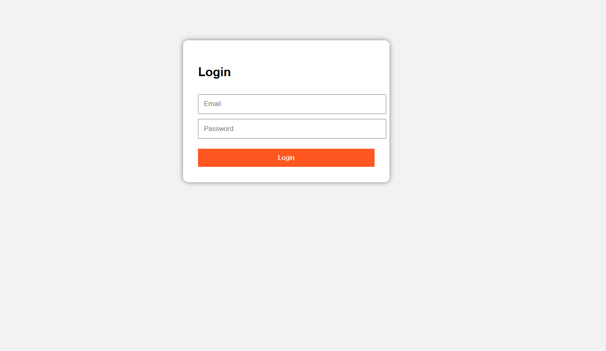

### Register Page
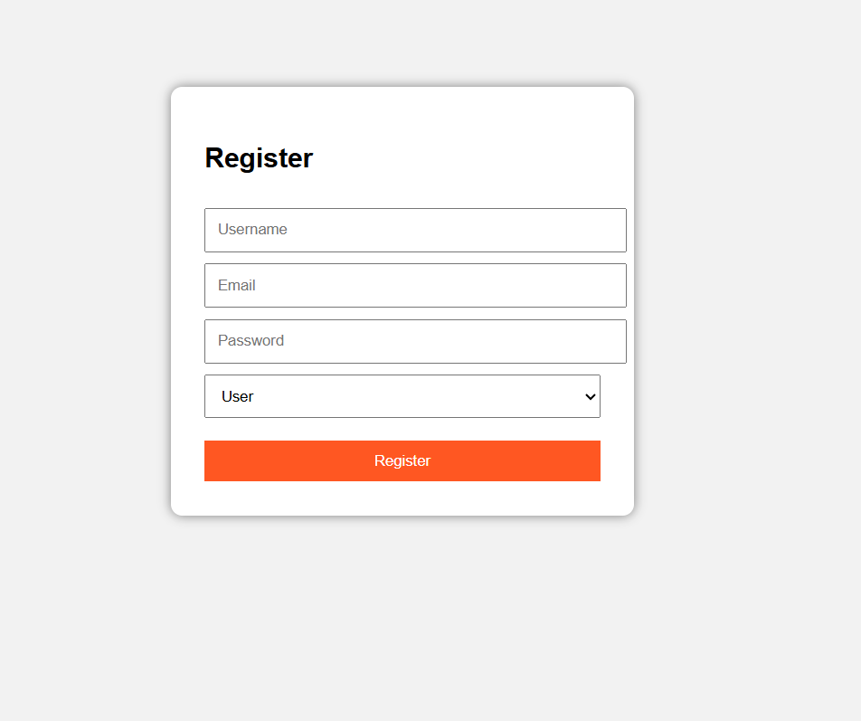

### Admin Dashboard
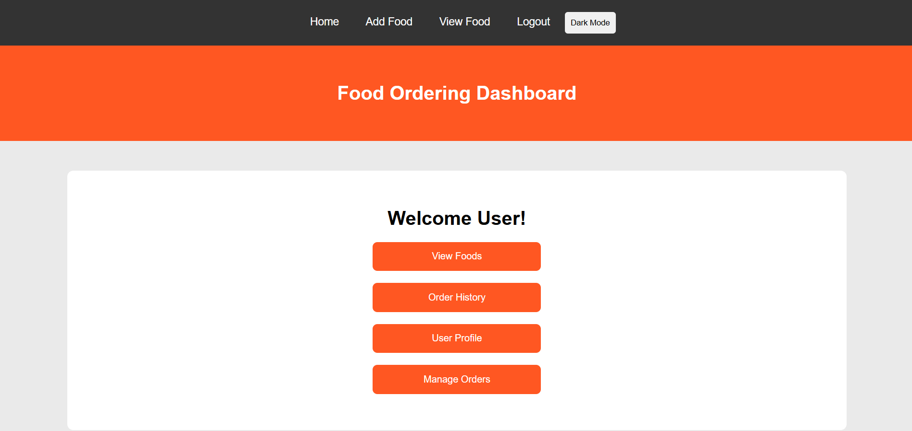

### User Dashboard
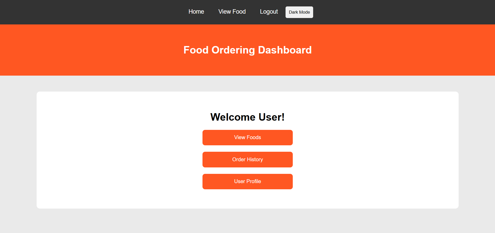

### Add Food Page
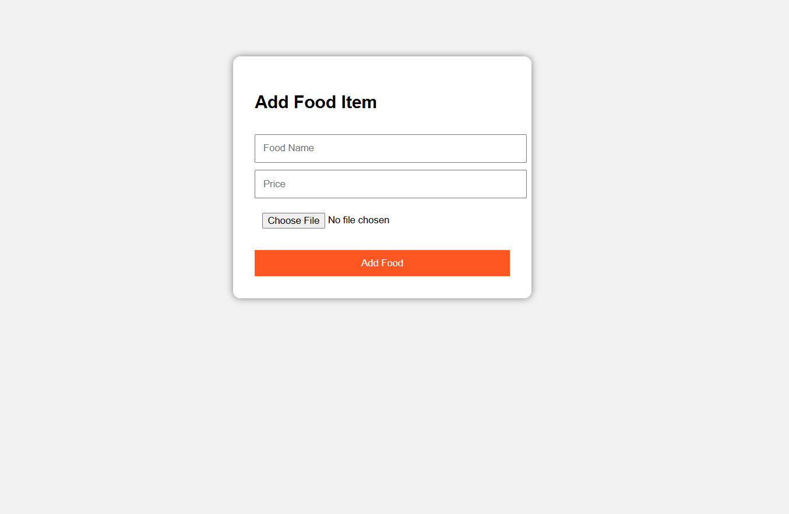

### Admin Menu
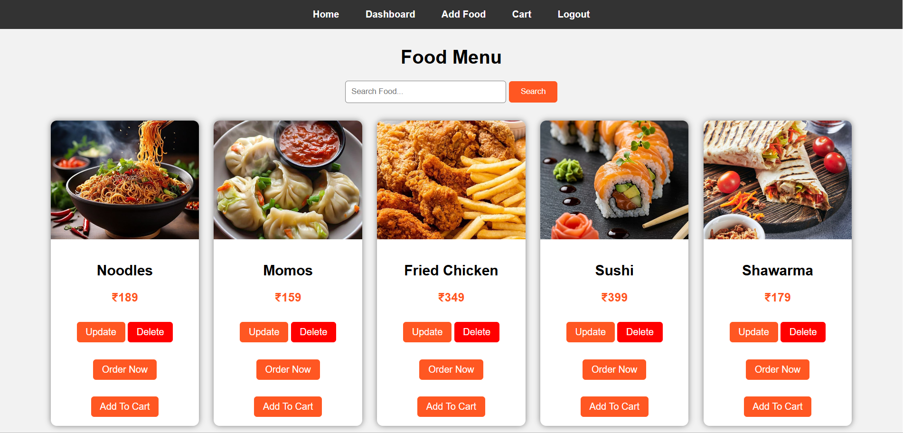

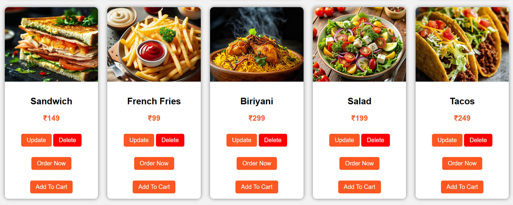

### User Menu


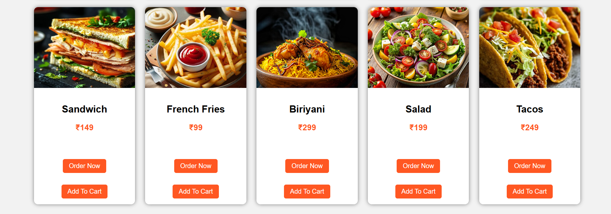

### Order History
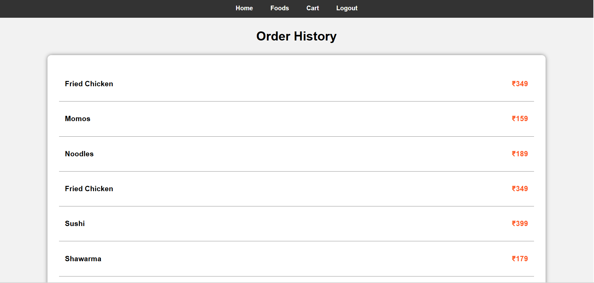

### Order Management
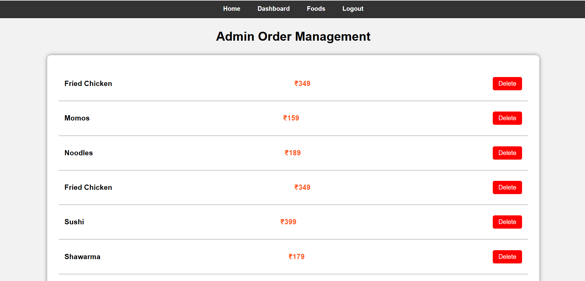

### User Profile
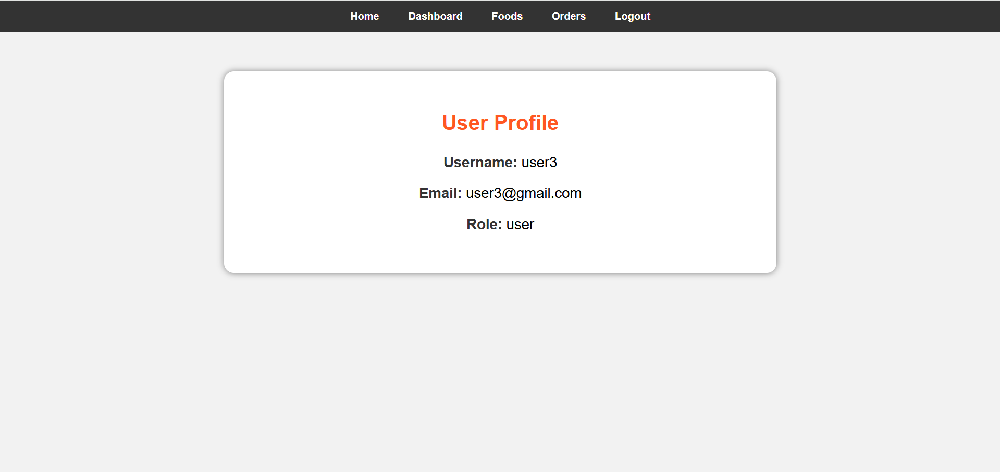

### Admin Profile
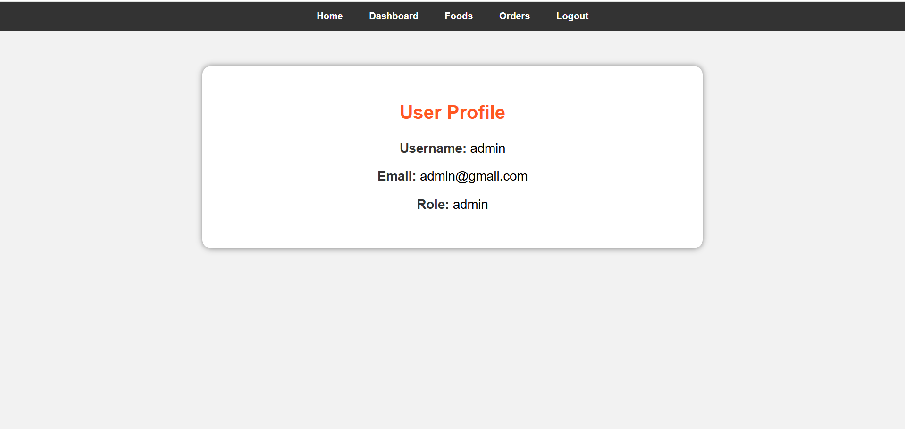

### Dark Mode
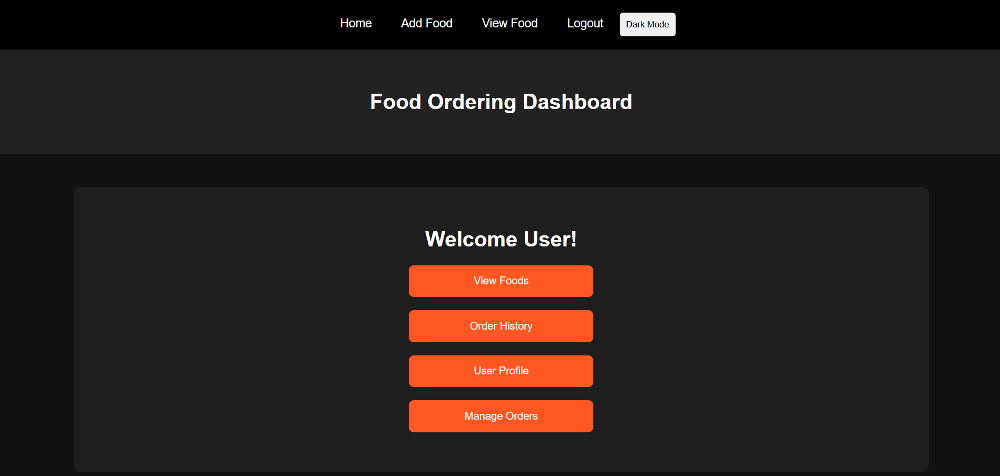
